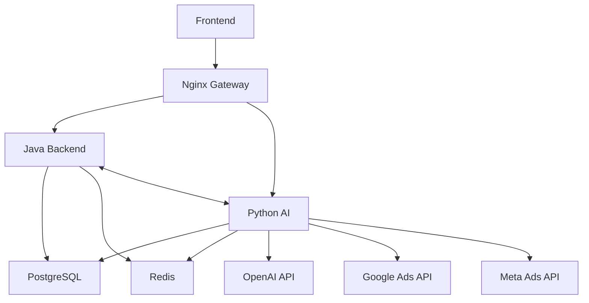

# STRATYON Microservices - Quick Start Guide

## 🚀 Quick Start (Docker Compose)

### Prerequisites
- Docker 20.10+
- Docker Compose 2.0+
- 8GB RAM minimum
- 20GB disk space

### 1. Clone and Configure

```bash
cd geoint

# Copy environment template
cp .env.example .env

# Edit .env and add your API keys
nano .env
```

### 2. Start All Services

```bash
# Start all microservices
docker-compose -f docker-compose.microservices.yml up -d

# View logs
docker-compose -f docker-compose.microservices.yml logs -f

# Check service health
docker-compose -f docker-compose.microservices.yml ps
```

### 3. Verify Services

```bash
# Nginx Gateway
curl http://localhost/health
# Response: {"status":"healthy","services":["java","python","nginx"]}

# Java Service
curl http://localhost/api/v1/health/java
# Response: {"status":"UP"}

# Python Service
curl http://localhost/api/v1/health/python
# Response: {"status":"healthy"}
```

### 4. Access Applications

- **Frontend:** http://localhost:3000
- **API Gateway:** http://localhost
- **Java API Docs:** http://localhost/docs/java
- **Python API Docs:** http://localhost/docs/python
- **Java Direct:** http://localhost:8080
- **Python Direct:** http://localhost:8000

## 📊 Service Ports

| Service | Port | Purpose |
|---------|------|---------|
| Nginx | 80 | API Gateway |
| Java Backend | 8080 | Spring Boot Service |
| Python AI | 8000 | FastAPI AI Service |
| PostgreSQL | 5432 | Database |
| Redis | 6379 | Cache |
| Frontend | 3000 | Next.js App |

## 🔐 Authentication Flow

### 1. Register User

```bash
curl -X POST http://localhost/api/v1/auth/register \
  -H "Content-Type: application/json" \
  -d '{
    "email": "user@example.com",
    "password": "SecurePassword123!",
    "full_name": "John Doe"
  }'
```

### 2. Login and Get JWT

```bash
curl -X POST http://localhost/api/v1/auth/login \
  -H "Content-Type: application/json" \
  -d '{
    "email": "user@example.com",
    "password": "SecurePassword123!"
  }'

# Response:
# {
#   "access_token": "eyJhbGciOiJIUzUxMiJ9...",
#   "token_type": "bearer"
# }
```

### 3. Use JWT for Authenticated Requests

```bash
# Set JWT token
export JWT_TOKEN="your_jwt_token_here"

# Make authenticated request
curl -X GET http://localhost/api/v1/keywords \
  -H "Authorization: Bearer $JWT_TOKEN"
```

## 🧪 Example API Calls

### Create Keyword (Java Service)

```bash
curl -X POST http://localhost/api/v1/keywords \
  -H "Authorization: Bearer $JWT_TOKEN" \
  -H "Content-Type: application/json" \
  -d '{
    "keyword": "e-ticaret yazılımı",
    "is_active": true
  }'
```

### Analyze Keyword with NLP (Python Service)

```bash
curl -X POST http://localhost/api/v1/nlp/analyze \
  -H "Authorization: Bearer $JWT_TOKEN" \
  -H "Content-Type: application/json" \
  -d '{
    "keyword": "e-ticaret yazılımı"
  }'
```

### Generate AI Strategy (Python Service)

```bash
curl -X POST http://localhost/api/v1/ai/strategies/generate \
  -H "Authorization: Bearer $JWT_TOKEN" \
  -H "Content-Type: application/json" \
  -d '{
    "name": "Q1 2025 E-commerce Strategy",
    "primary_goal": "Increase online sales by 50%",
    "target_keywords": ["e-ticaret", "online satış", "dijital pazarlama"],
    "total_budget": 50000
  }'
```

## 🔧 Development Mode

### Run Services Separately

**Java Service:**
```bash
cd java-services
mvn spring-boot:run -Dspring-boot.run.profiles=dev
```

**Python Service:**
```bash
cd backend
python -m venv venv
source venv/bin/activate  # On Windows: venv\Scripts\activate
pip install -r requirements.txt
uvicorn app.main:app --reload --port 8000
```

**Frontend:**
```bash
cd frontend
npm install
npm run dev
```

### Database Migrations

**Java (Flyway):**
```bash
cd java-services
mvn flyway:migrate
```

**Python (Alembic):**
```bash
cd backend
alembic upgrade head
```

## 📦 Service Dependencies



## 🔄 Service Communication Examples

### Java Calls Python (AI Strategy)

```java
// Java Service
@Service
public class StrategyService {
    @Autowired
    private PythonAIClient pythonClient;

    public Strategy generateAIStrategy(StrategyRequest request) {
        // Call Python AI service
        AIStrategyResponse response = pythonClient.generateStrategy(request);

        // Save to database (Java handles persistence)
        Strategy strategy = strategyMapper.toEntity(response);
        return strategyRepository.save(strategy);
    }
}
```

### Python Calls Java (Get User Data)

```python
# Python Service
async def generate_strategy(user_id: str, jwt_token: str):
    # Call Java service to get user's keywords
    async with httpx.AsyncClient() as client:
        response = await client.get(
            f"{JAVA_SERVICE_URL}/api/v1/keywords",
            headers={"Authorization": f"Bearer {jwt_token}"}
        )
        keywords = response.json()

    # Use LLM to generate strategy
    strategy = await openai_service.generate_strategy(keywords)

    # Call Java service to save
    await client.post(
        f"{JAVA_SERVICE_URL}/api/v1/strategies",
        json=strategy,
        headers={"Authorization": f"Bearer {jwt_token}"}
    )
```

## 🐛 Troubleshooting

### Services Won't Start

```bash
# Check logs
docker-compose -f docker-compose.microservices.yml logs

# Restart specific service
docker-compose -f docker-compose.microservices.yml restart java-backend

# Rebuild and restart
docker-compose -f docker-compose.microservices.yml up -d --build
```

### Database Connection Issues

```bash
# Check PostgreSQL is running
docker-compose -f docker-compose.microservices.yml exec postgres psql -U postgres -c "SELECT 1"

# View PostgreSQL logs
docker-compose -f docker-compose.microservices.yml logs postgres
```

### Redis Connection Issues

```bash
# Test Redis connection
docker-compose -f docker-compose.microservices.yml exec redis redis-cli ping
# Response: PONG
```

### Java Service Issues

```bash
# Check Java logs
docker-compose -f docker-compose.microservices.yml logs java-backend

# Enter container
docker-compose -f docker-compose.microservices.yml exec java-backend sh

# Check Java version
docker-compose -f docker-compose.microservices.yml exec java-backend java -version
```

### Python Service Issues

```bash
# Check Python logs
docker-compose -f docker-compose.microservices.yml logs python-ai

# Enter container
docker-compose -f docker-compose.microservices.yml exec python-ai sh

# Test API manually
docker-compose -f docker-compose.microservices.yml exec python-ai curl localhost:8000/health
```

## 📊 Monitoring

### View Resource Usage

```bash
docker stats
```

### View All Container Status

```bash
docker-compose -f docker-compose.microservices.yml ps
```

### Check Logs in Real-time

```bash
# All services
docker-compose -f docker-compose.microservices.yml logs -f

# Specific service
docker-compose -f docker-compose.microservices.yml logs -f java-backend
docker-compose -f docker-compose.microservices.yml logs -f python-ai
```

## 🛑 Stopping Services

```bash
# Stop all services
docker-compose -f docker-compose.microservices.yml down

# Stop and remove volumes (⚠️ deletes data)
docker-compose -f docker-compose.microservices.yml down -v

# Stop specific service
docker-compose -f docker-compose.microservices.yml stop java-backend
```

## 📚 Next Steps

1. **Complete Java Implementation:**
   - Implement all controllers, services, and repositories
   - See `java-services/src/main/java/com/stratyon/`

2. **Refactor Python for AI/ML Only:**
   - Remove CRUD operations from Python endpoints
   - Focus on AI/ML features in `backend/app/api/v1/endpoints/`

3. **Add Service Discovery:**
   - Implement Eureka or Consul for dynamic service discovery

4. **Add Distributed Tracing:**
   - Integrate Jaeger or Zipkin for request tracing

5. **Production Hardening:**
   - Add HTTPS/SSL certificates to Nginx
   - Implement proper secrets management
   - Add monitoring (Prometheus + Grafana)
   - Set up CI/CD pipeline

## 🔗 Related Documentation

- [MICROSERVICES_ARCHITECTURE.md](./MICROSERVICES_ARCHITECTURE.md) - Detailed architecture
- [API_TOKENS_GUIDE.md](./API_TOKENS_GUIDE.md) - API credentials setup
- [README.md](./README.md) - Project overview
- [Java Swagger Docs](http://localhost/docs/java)
- [Python FastAPI Docs](http://localhost/docs/python)
